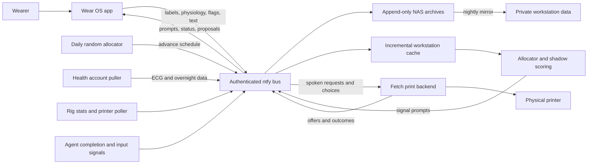

# Architecture and source map

Reviewed against the working tree on 2026-09-06. This describes local code and
recorded decisions, not a fresh verification of deployed services.

## What the system is for

The owner's sequence is collection → a useful personal state model → support for
learning to notice states independently ([health design](../HEALTH_DESIGN.md)).
The second standing use is a quiet wrist interface to machines and agents.
Reliable capture, low interruption burden, and honest uncertainty connect those
goals. A useful dashboard must not corrupt the instrument collecting its evidence.

## Components and flow

The diagram names logical streams, not actual configured topic names. The watch
also reads the printer directly on the LAN for details using a separate credential
path. Internet bus transport does not expose the printer API.

This table maps responsibilities to their current implementation.

| Responsibility | Code location | Important boundary |
|---|---|---|
| State grid, retro labels, confirmation | `app/.../ui/TagActivity.kt` | Explicit recording; event time differs from entry time |
| Immutable label records and offline queue | `app/.../data/` | Room v3; additive provenance migration; current face state in DataStore |
| Upload and chunking | `app/.../work/DrainWorker.kt` | Database-backed retry; silent posts; oversized batches split |
| Passive physiology and notification flags | `app/.../health/`, `app/.../flags/` | Owned collection and captured vendor notifications are distinct |
| Prompt delivery and delayed vendor cues | `app/.../work/PromptWorker.kt`, `CueWorker.kt` | Blinding, one-hour protection, deferred random vs lapsed signal |
| Face status and tap frames | `app/.../complication/`, `app/.../ui/` | Cache age survives network loss; small round-screen layout |
| Bus, printer reads, print proposals | `app/.../net/` | Bus bearer credentials must not reach printer/image hosts |
| Workstation ingestion and detector | [tools/rig](../tools/rig/README.md) | Some scripts publish or append records on execution |
| NAS deployment and printer status | [tools/server](../tools/server/README.md), [tools/printer](../tools/printer/README.md) | Running archives and physical equipment; provision scripts are mutations |
| Agent signals and Git guards | [tools/hooks](../tools/hooks/README.md) | Existing adapters are Claude-specific; portable bus contract is the seam |

`app/.../` means `app/src/main/java/com/emotiveautomaton/wristwork/`.

## Current behavior versus historical planning

The living spec contains sequential design passes; read its later dated amendments.
These are the most consequential changes an incoming agent could otherwise miss:

- Full wear-day battery acceptance replaces the old 3% target; passive services and
  periodic prompt polling exist. DECISIONS D4's "no periodic jobs" is historical.
- Grid confirmation replaces automatic saving on exit. OTHER now displays as Neutral;
  mixtures without a primary are valid. Old slider/display designs are historical.
- The detector consumes the owned watch stream through an incremental cache. The
  original detector design's Google intraday HRV dependency is not the implementation.
  Health-account ECG and overnight ingestion run alongside it. BPM variability is
  not beat-to-beat HRV; no scientific validity is established by this source review.
- The one-hour rule and random deferral supersede the earlier random exemption.
  The 2026-09-02 spec marks the first two random labels as unblinded. Preserve this
  dated caveat and review cohort handling before using them as evidence.
- Print candidates can already contain slicer numbers. Tap inspects; hold sends a
  potentially executing choice. The older two-stage voice-to-print plan is history.
- The bus was recorded as authenticated and remotely reachable on 2026-08-26;
  earlier LAN-only descriptions are not a statement of current deployment health.

## Structure recommendations

Keep the single Android module and existing watch/server/rig/printer split for now.
The responsibilities already fit; wholesale moving would churn paths used by
scheduled tasks and provisioning without improving behavior.

As the next functional changes land, extract pure prompt-eligibility, provenance,
and proposal-validation logic from workers/activities. Give those rules synthetic
fixtures before sharing/refactoring them. Keep Android delivery separate from
research decisions; keep Fetch execution outside this repo.

Add a small versioned contract area for bus schemas and synthetic examples when
the watch/Fetch seam is next changed. Validate both producer and consumer against
it; the existing feasibility document is not a wire-format specification.

Use [STATE](STATE.md) for dated observations, [DECISIONS](DECISIONS.md) for rationale,
the living spec for intended behavior, and [ROADMAP](ROADMAP.md) for proposed work.
Avoid copying live counts and dates into all four. Resolve old decisions with
supersession notes rather than erasing the reasons they were made.
